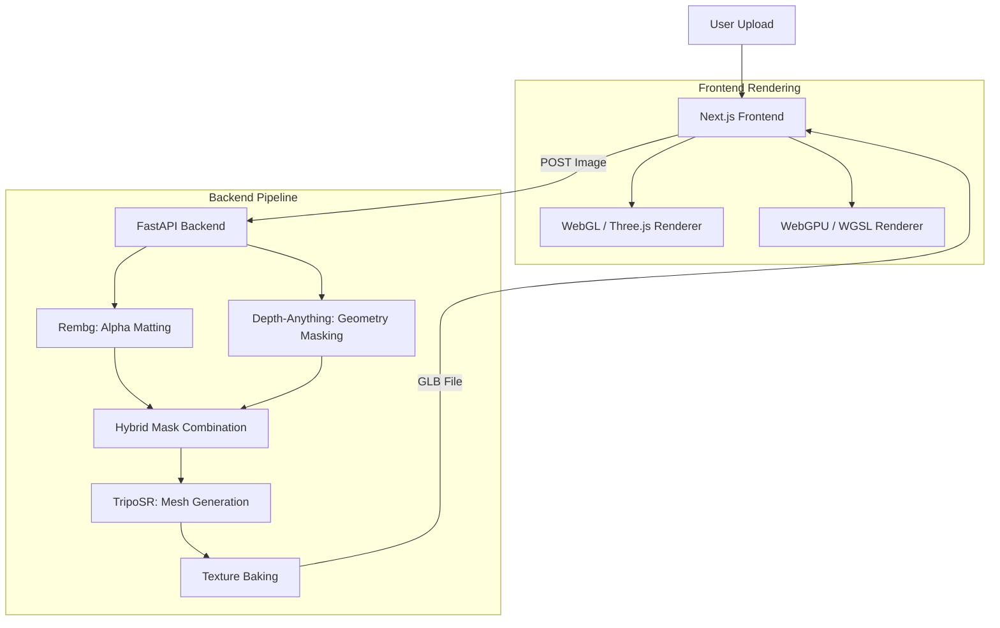

# Nouveau Morphisme: 3D Icon Composer

## 1\. Project Overview

**3D Icon Composer** is a full-stack AI application that transforms 2D static images into interactive, physically-based 3D assets.

Unlike simple wrapper applications, this project solves the common "floating noise" and "flat geometry" artifacts found in single-view reconstruction by implementing a **novel hybrid computer vision pipeline**. 

Furthermore, it shows a journey to the dual-rendering engine system, allowing users to switch between standard WebGL and a custom-built **WebGPU** engine written in raw WGSL for advanced lighting physics.

### 🎯 Key Goals & Creativity

1.  **Hybrid Preprocessing Pipeline:** Combining Semantic Segmentation (`rembg`) with Monocular Depth Estimation (`Depth-Anything V2`) to intelligently separate foreground objects before 3D generation.
2.  **Next-Gen Rendering:** Implementing a custom Cook-Torrance microfacet BRDF shader from scratch using the **WebGPU API**, moving beyond standard library capabilities.

-----

## 2\. Demo & Screenshots

> *[Please insert screenshots of your running application here to avoid the -4 penalty]*

| **Input Image** | **3D Generation (WebGL)** | **WebGPU PBR Mode** |
| :---: | :---: | :---: |
|  |  |  |
| *Original 2D Icon* | *Generated Mesh* | *Custom Shader w/ Fresnel* |

-----

## 3\. Features

  * **🤖 AI-Powered Reconstruction:** Generates 3D meshes from images in \~15-30 seconds using **TripoSR**.
  * **🧠 Smart Background Removal:**
      * **Tier 1:** Alpha matting & morphological noise removal.
      * **Tier 2:** Depth-guided masking to remove background elements that share colors with the foreground.
  * **🖥️ Dual Rendering Engines:**
      * **WebGL (Three.js):** Robust rendering with preset artistic shaders (Toon, Wireframe, Normal).
      * **WebGPU (Custom):** Experimental high-performance engine utilizing compute shaders for true PBR (Physically Based Rendering).
  * **⚡ Hardware Optimization:** Automatically detects and utilizes NVIDIA CUDA (Windows/Linux) or Apple Metal (macOS/MPS) for inference.

-----

## 4\. System Architecture

The project is structured as a Monorepo containing a Python FastAPI backend and a Next.js frontend.



### Tech Stack

  * **Backend:** Python 3.10+, FastAPI, PyTorch, NumPy, Trimesh, OpenCV.
  * **Frontend:** TypeScript, Next.js 16 (React 19), Tailwind CSS.
  * **Graphics:** WebGPU (WGSL), WebGL (Three.js / React-Three-Fiber).

-----

## 5\. Installation & Usage

### Prerequisites

  * **Python:** 3.10 or higher
  * **Node.js:** 18 or higher
  * *(Optional)* GPU with CUDA or Metal support is highly recommended for performance.

### 🚀 One-Command Start (Recommended)

I have provided a script to automate the setup of both environments.

```bash
# 1. Clone the repository
git clone [YOUR_REPO_URL]
cd [YOUR_REPO_NAME]

# 2. Run the startup script (Installs dependencies & starts servers)
chmod +x start.sh
./start.sh
```

### 🏃 Manual Start

If the script does not work, run the services in two separate terminals:

**Terminal 1: Backend**

```bash
cd backend
python3 -m venv venv
source venv/bin/activate  # Windows: venv\Scripts\activate
pip install -r requirements.txt
python main.py
# Server running at http://localhost:8000
```

**Terminal 2: Frontend**

```bash
cd frontend
npm install
npm run dev
# Client running at http://localhost:3000
```

-----

## 6\. Implementation Details (Difficulty)

### A. The Hybrid Masking Pipeline

Standard background removal (`rembg`) often fails when the background color is similar to the object, resulting in "floating" artifacts in the 3D mesh.

  * **My Solution:** I implemented `DepthGuidedMasker` in `backend/depth_masking.py`. It uses a Vision Transformer (Depth-Anything V2) to determine the Z-distance of pixels. Even if a background pixel is the same color as the icon, it is removed because it is geometrically far away.

### B. Custom WebGPU Shaders

Instead of relying solely on libraries, I implemented the rendering logic using raw **WGSL** (WebGPU Shading Language).

  * **Vertex Shader:** Handles matrix transformations (Model-View-Projection).
  * **Fragment Shader:** Implements the **Cook-Torrance BRDF** lighting model manually, including:
      * Fresnel-Schlick approximation for reflection.
      * GGX Normal Distribution Function for surface roughness.
      * ACES Tone Mapping for color correctness.

-----

## 7\. Open Source Licenses & References

This project utilizes several open-source libraries. I hereby acknowledge their licenses and attribute the original authors.

### Core AI Models

1.  **TripoSR**
      * **Usage:** Used for the core image-to-3D mesh generation logic.
      * **License:** MIT License
      * **Reference:** [Tochilkin et al., 2024](https://github.com/VAST-AI-Research/TripoSR)
2.  **Depth-Anything V2**
      * **Usage:** Used for depth map estimation in the masking pipeline.
      * **License:** Apache 2.0
      * **Reference:** [LiheYoung et al., 2024](https://github.com/DepthAnything/Depth-Anything-V2)
3.  **Rembg**
      * **Usage:** Used for initial semantic segmentation (U2Net).
      * **License:** MIT License
      * **Reference:** [Daniel Gatis](https://github.com/danielgatis/rembg)

### Rendering & Frameworks

  * **Three.js / React Three Fiber:** MIT License (Rendering fallback).
  * **FastAPI:** MIT License (Backend framework).
  * **Next.js:** MIT License (Frontend framework).

*All other code, including the `preprocessing.py` logic, `depth_masking.py` hybrid strategies, and the `lib/webgpu` WGSL shader implementations, is my own work.*

-----

## 8\. License

This project is released under the **MIT License**.

```text
MIT License

Copyright (c) 2025 Kwon Joonhyeok

Permission is hereby granted, free of charge, to any person obtaining a copy
of this software and associated documentation files (the "Software"), to deal
in the Software without restriction, including without limitation the rights
to use, copy, modify, merge, publish, distribute, sublicense, and/or sell
copies of the Software, and to permit persons to whom the Software is
furnished to do so, subject to the following conditions:
...
```